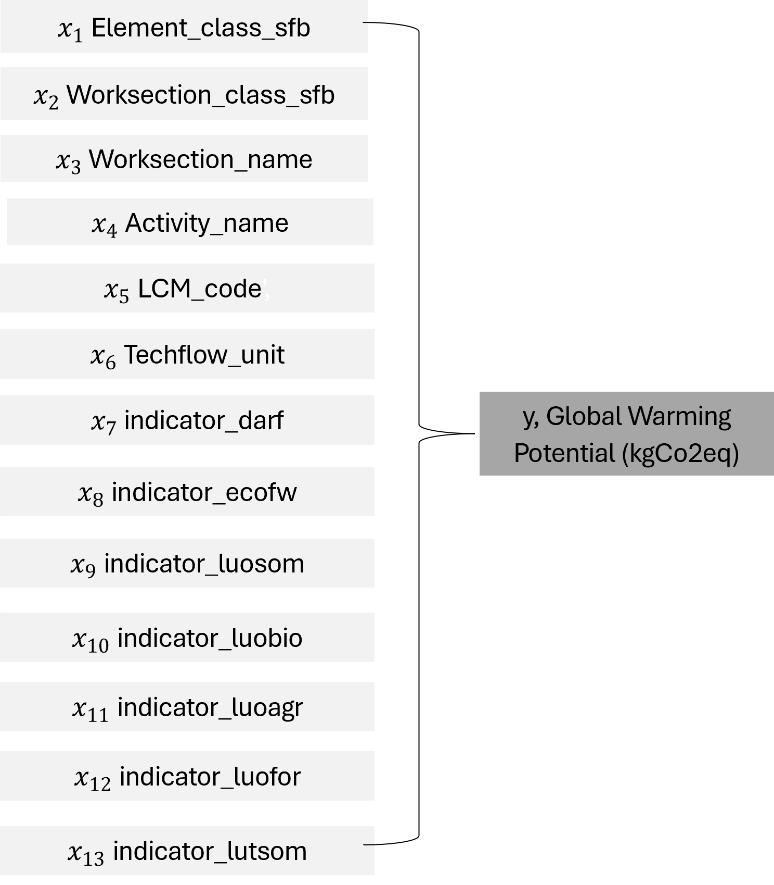
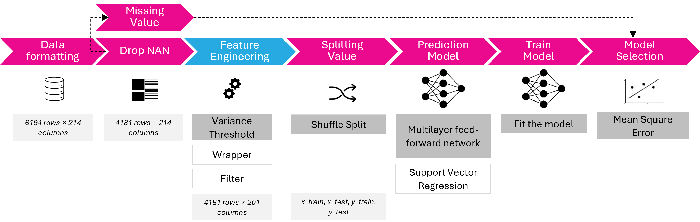

#  Use Case 2 - Prediciton of Material Environmental Indicator

### Use Case Specification
This use case specifies on the semantic definition, modelling, and prediction of materials environmental performance indicators.

### Data Source
The SLiCE data model provides information to material’s and building element’s environmental impacts. SLiCE (Röck et al., 2023) is developed as a tool for systematic analysis of environmental hotspot across the life cycle of buildings and construction elements using data compliant with the SLiCE building data model.

### Conceptual Model
The following conceptual model is designed:
(a) inputs (Xn) are the independent variables, reaching from material name to the selected environmental impacts categories.
(b) outputs (Yn) is the dependent variables, the global warming potential. 

### Integration pipeline
ANN and SVM is choose due to handling more complex, non-linear relationship and bigger amount of data. The missing values are dismissed and feature engineering is applied to analyse the significancy of the features relationships using the data variance, the level of relevant information contained within a variable in relation to the others. It reduced the number of features (the impact category) from 27 to 8. Furhtermore, the string values, such as material names are encoded to an multi-dimensional array to include the full information per material property record.

**Multilayer perceptron (MLP) Artificial Neural Network (ANN)**\
An Artificial Neural Network (ANN) is a computational model inspired by the way biological neural networks in the human brain operate. It consists of interconnected layers of nodes, called neurons, that work together to process information and make decisions.\

ANNs can be mathematically considered as a nonlinear regression model f(x) = φ(w,x), where φ is a nonlinear activation function. Perceptron are the basic units of ANNs. Neural networks are trained using techniques called feedforward propagation and backpropagation. A Feedforward Neural Network (FNN) is a type of artificial neural network where information moves only in one direction, from the input layer through any hidden layers and finally to the output layer. They are well-suited for tasks that require a simple, one-way processing of data — including pattern recognition and predictive modelling. This use case studies the neural network feedforward architecture, using the library Keras and Tenserflow.\

**Support Vector Machine (SVM)**\
Support Vector Regression (SVR) is an extension of Support Vector Machine (SVM) which introduces a region, named tube, around the function to optimize. The aim is to find the tube that best approximates the continuous-valued function while minimizing the prediction error, that is, the difference between the predicted and the true value.\

The loss function uses ε- insensitive loss, which increases robustness and allows to obtain sparse solutions. The ε-insensitive loss function delimits a ‘‘tube-shaped’’ region, centred around the hypothesis function, inside which errors are neglected. Different loss functions can be used, such as linear, quadratic or radial.\

### Data quality
##### Data source
Data definitions and calculations follow EN 15978 
##### Terminology 
| Terminology | Class |  Instance | 
| :-----------------:   | :----------: | :----------: |
|Spatial attribute (keys)|  |"EW05 CLT + str blown" 
| Element   | ElementName |  "21"
| Element | ElementClassification |"Wall - external finish, Cladding, Panel, Cork (32-80 mm)" 
| Worksection | WorksectionName |  "Cork (32-80mm)"
| Product/Propcess | ActivityName |  "Cork slab {RER}| production | Alloc Rec, U"
| TechflowName | TechflowName |
|Temporal attribute (keys)| |
| LifeCycleStage | LCSName |  "A1-3: Product stage"
| LifeCycleModule | LCMCode |  "A1-3"
| PointInTime | ActivityYear | "0"
| ActivityType | ActivityType | "Material in"
| Indicator Attributes (values) |      |
| LCIamounts | techflowAmount | "11.2"
| LCIamounts | TechflowUnit | "tkm"
| LCIA results | indicatorGWP | "15.7813488"
| LCIA results | indicator_PM | "0.0143808"
| LCIA results | indicator_EP | "0.0098672"

##### Completeness 
(Number of empty value)
fully open to public, missing value for all indicators: 2014/6195
#####  Relevance 
(What is the purpose of the data, how can we use it)
A tool for systematic analysis of environmental hotspot across the life cycle of buildings and construction elements using data compliant with the SLiCE building data model.

##### Reliability 
(Are the indicator definition and data collection and analysis processes clear and are these consistently applied over time)
Indicators used are in line with LCA standardisations, follow EN 15978.

## FAIR Analysis
### Findable
URI: https://github.com/mroeck/slice_hotspots/tree/develop
### Accessible:
### Interoperable:
### Reusable:
