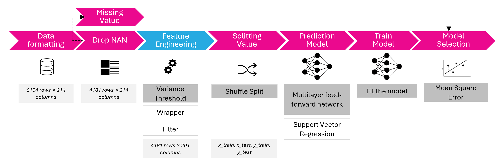

#  Use Case 2 - Prediciton of Material Environmental Indicator

### Use Case Specification
This use case specifies on the semantic definition, modelling, and prediction of materials environmental performance indicators.

### Data Source
The SLiCE data model provides information to material’s and building element’s environmental impacts. SLiCE (Röck et al., 2023) is developed as a tool for systematic analysis of environmental hotspot across the life cycle of buildings and construction elements using data compliant with the SLiCE building data model.

### Conceptual Model
The following conceptual model is designed:
(a) inputs (Xn) are the independent variables, reaching from material name to the selected environmental impacts categories.
(b) outputs (Yn) is the dependent variables, the global warming potential. 

| Features | Notation | Description |
| :-----------------:   | :----------: | :----------: |
| Indicator_GWP | GWP_Climate change  | total, fossil, biogenic, and land use (kg CO2-eq) Indicator of potential global warming due to emissions of greenhouse gases to the air. Divided into 3 subcategories based on the emission source: (1) fossil resources, (2) bio-based resources, and (3) land use change.
| indicator_darf   | Depletion of abiotic resources – fossil fuels  | (MJ, net calorific value) Indicator of the depletion of natural fossil fuel resources.  Measure the extent to which the use of non-renewable fossil fuel resources, such as coal, oil, and natural gas, is reducing the availability of these resources for future generations.
| indicator_ecofw  | Eco-toxicity (freshwater) |(kg PO4-eq) indicator of the enrichment of the freshwater ecosystem with nutritional elements, due to the emission of nitrogen or phosphor-containing compounds.
| indicator_luosom  | Land Use, Occupation, Soil Organic Matter | text
| indicator_luobio  | Land Use, Biodiversity | text
| indicator_luoagr   | Land Use, Agricultural | text
| indicator_luofor  | Land Use, Forestry | text
| indicator_lutsom  | Land Use, Transformation, Soil Organic Matter | text 

### Integration pipeline
ANN and SVM is choose due to handling more complex, non-linear relationship and bigger amount of data. The missing values are dismissed and feature engineering is applied to analyse the significancy of the features relationships using the data variance, the level of relevant information contained within a variable in relation to the others. It reduced the number of features (the impact category) from 27 to 8. Furhtermore, the string values, such as material names are encoded to an multi-dimensional array to include the full information per material property record.

**Multilayer perceptron (MLP) Artificial Neural Network (ANN)**\
An Artificial Neural Network (ANN) is a computational model inspired by the way biological neural networks in the human brain operate. It consists of interconnected layers of nodes, called neurons, that work together to process information and make decisions.

ANNs can be mathematically considered as a nonlinear regression model f(x) = φ(w,x), where φ is a nonlinear activation function. Perceptron are the basic units of ANNs. Neural networks are trained using techniques called feedforward propagation and backpropagation. A Feedforward Neural Network (FNN) is a type of artificial neural network where information moves only in one direction, from the input layer through any hidden layers and finally to the output layer. They are well-suited for tasks that require a simple, one-way processing of data — including pattern recognition and predictive modelling. This use case studies the neural network feedforward architecture, using the library Keras and Tenserflow.

**Support Vector Machine (SVM)**\
Support Vector Regression (SVR) is an extension of Support Vector Machine (SVM) which introduces a region, named tube, around the function to optimize. The aim is to find the tube that best approximates the continuous-valued function while minimizing the prediction error, that is, the difference between the predicted and the true value.

The loss function uses ε- insensitive loss, which increases robustness and allows to obtain sparse solutions. The ε-insensitive loss function delimits a ‘‘tube-shaped’’ region, centred around the hypothesis function, inside which errors are neglected. Different loss functions can be used, such as linear, quadratic or radial.

### Data quality
##### Data source
Data definitions and calculations follow EN 15978 
##### Terminology 
| Terminology | Class |  Instance | 
| :-----------------:   | :----------: | :----------: |
|Spatial attribute (keys)|  |"EW05 CLT + str blown" 
| Element   | ElementName |  "21"
| Element | ElementClassification |"Wall - external finish, Cladding, Panel, Cork (32-80 mm)" 
| Worksection | WorksectionName |  "Cork (32-80mm)"
| Product/Propcess | ActivityName |  "Cork slab {RER}| production | Alloc Rec, U"
| TechflowName | TechflowName |
|Temporal attribute (keys)| |
| LifeCycleStage | LCSName |  "A1-3: Product stage"
| LifeCycleModule | LCMCode |  "A1-3"
| PointInTime | ActivityYear | "0"
| ActivityType | ActivityType | "Material in"
| Indicator Attributes (values) |      |
| LCIamounts | techflowAmount | "11.2"
| LCIamounts | TechflowUnit | "tkm"
| LCIA results | indicatorGWP | "15.7813488"
| LCIA results | indicator_PM | "0.0143808"

##### Completeness (Number of empty value)
fully open to public, missing value for all indicators: 2014/6195

#####  Relevance (What is the purpose of the data, how can we use it)
A tool for systematic analysis of environmental hotspot across the life cycle of buildings and construction elements using data compliant with the SLiCE building data model.

##### Reliability (Are the indicator definition and data collection and analysis processes clear and are these consistently applied over time)
Indicators used are in line with LCA standardisations, follow EN 15978.

## FAIR Analysis
### Findable (Meta data, unique identifier to every element of metadata and every concept/measurement in the dataset)
Metadata and data to be found:
* F1.01 & F1.02 Qualified Referencing: URL and GUID (see below): Röck M, Passer A, Allacker K. “SLiCE: An Open Data Model for Scalable High-Definition Life Cycle Engineering, Hotspot Analysis and Dynamic Assessment of .Buildings.” 2023, Preprint DOI: .https://doi.org/10.5281/zenodo.8369244 . The SLiCE building data model as well as the presented implementation in the SLiCE hotspot analysis prototype are open source and available  with this article. The SLiCE hotspot analysis, implemented as an IPython Jupyer Notebook with interactive widgets, tool is available on Github (https://github.com/mroeck/slice_hotspots/), with the submission pre-release published via Zenodo (https://zenodo.org/badge/latestdoi/645859866). All items are published under a GNU General Public License v3.0. We encourage you to review, reuse, and refine the model and scripts and share-alike.
* F2.01 Richness of Metadata: Requirements included: ID (1), Creator (1), Title(1), Publisher (1), PublicationYear (1), URL(1), Description(1), Date (dateCreated, dateModified)(0.5), ResourceType (1), License (1),  ContributorName (0.5). Requirements excluded:  MeasurementTechnique (0.5), Keywords (0.5), variableMeasured (0.5), DataFormat (0.5), DataVersion (0.5),  DataFormat(0.5), AlternateIdentifier(0.25), RelatedIdentifier(0.25), Size(0.25),  FundingReference(0.25),  referenceCitation (0.25), GeoLocation (0.25), IncludedIn (0.25), Language(0.25)
* F3.01 Inclusion of Data Identifier in Metadata (Qualified Referencing >> URL): 
    - References of the database, dataset, data entry>> via a citation (hyperlinks) or a URL, see  F1.01.
    - Additionally focusing on:
    - References to Related Entities  >> Related Entities (reference citations, related articles, related data entries), Includes qualified references (URL, DOI etc),  >> I3.01-03
    - References to Content Integrity Property >> Data measurement techniques or observed, data processing method or collection of data, data format and size >> R1.01 
    - References to Provenance Property >> via citations (hyperlinks) or a URL, see R1.01-02
* F4.01 Searchable Metadata (>>accessible/retrievable >> manual/machines):
    - Metadata and data is accessible as structured data embedded on web page (manual access)
    - Metadata and data can be retrieved as mashine readible version (CSV) 

### Accessible: The condition that makes data accessible (e.g., Protocol)
* A1.01 Access Condition: No access condition (open data)
* A1.02 Manual access & retrieval of (meta)data: Use the online platform (Github) to download machine-readable (CSV) data manually
* A1.03 Data Resolution: Metadata und Data resolves correctly, missing 
* A1.04 Standard communication Protocol: HTTP, HTTPS
* A1.05 Automatic access and retrieval of (meta)dat: No
* A1.1 Free protocol: Http refernece
* A1.2 Deploy Protocol through authentication and authorisation: Protocol through authentication and authorization. 
* A2 Preserve Metadata: n.a.

### Interoperable: Formal representations, data should be machine readable, following domain knowledge
* I1.01 Vocabulary follows domain standards: Controlled variables used according to LCA standard, not registered at FAIRsharing.
* I1.02 Formal Representation: CSV
* I2.01 Vocabulary (taxonomies, ontologies and thesauri): Follows domain-specific taxonomy, no ontology >> see terminology and instances, data source.
* I3.01-03 Qualified Reference to Related Entities"
    * Unqualified reference on a terminology level, Qualified references (URL) on data instance level [2] when linking to organisations, people, places, projects, or digital objects of previous or related research data 
    * Related works, "https://github.com/mroeck/slice_hotspots/tree/0.1.1 (URL)";
    * External Resources Available in, "mroeck/slice_hotspots Release: 0.1.1 (URL)";
    * Indexed in, "OpenAIRE (URL)";
    * Citation: RÖCK, M., PASSER, A., & ALLACKER, K. (2023). mroeck/slice_hotspots: Pre-release (0.1.1). Zenodo. https://doi.org/10.5281/zenodo.8366478 (URL)

### Reusable: Whether data is useful in other context, provide contextual information when data was created
* R1.01 Qualified Reference to Content Integrity
 * Unqualified reference citation (URL) on terminology and instance level >> regarding the processing method or collection of data is described: (in text description data processing method, according to EN 15978)
* R1.1.01 Data usage license: GNU GENERAL PUBLIC LICENSE  Version 3, 29 June 2007, GPL-3.0 license
* R1.01-02  Qualified Reference to Provenance Property:
    * Unqualified reference citation (URL) on terminolog, Qualified reference citation on instance level (URL, ORCID)
    * Provenance properties (chronology of the ownership):
        * 1 Source of data: description and reference (URL) are missing in the description and referencing.
        * 2 Data of creation or collection:  indication is missing in the description and referencing. Yet in the description mentions the data follows EN 15978.
        * 3 Creator and Contributors involved: [Authors, "RÖCK Martin (ORCID)"; "PASSER Alexander, (ORCID)"; "ALLACKER Karen, (ORCID)"]
        * 4 Data publication, modification and versioning information: [Created, "September 21, 2023"]; [Modified "September 29, 2023";  [Versions, "Version 0.1.1 10.5281/zenodo.8366478]]
        * 5 Additional processes: Datarights: >> rights are state as "Other (Open)"
* R1.03: (Meta)data complies with community standards: 
    * 1 Community (meta)data standards: not applicable in Datacite Metadata Schema, Dublin Core, Schema.org; 
    * 2 Data file formats, machine-readable community standards: Datacite:Format, schema.org: fileFormat, dc:format. Check